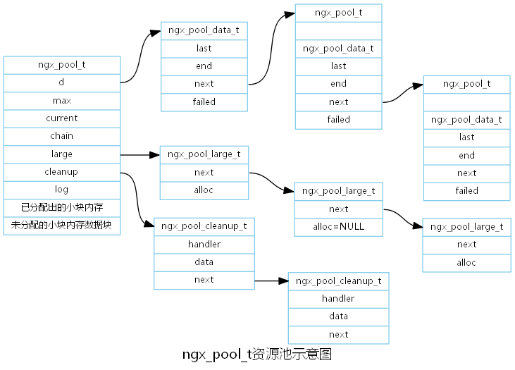

# 3.1 结构体

## 3.1.1 内存池

### 资源示意图 
```cpp
// 资源清理链表(关闭或者释放一些文件资源)
typedef void (*ngx_pool_cleanup_pt)(void *data);
typedef struct ngx_pool_cleanup_s ngx_pool_cleanup_t;
struct  ngx_pool_cleanup_s {
    ngx_pool_cleanup_pt handler;
    void                *data;
    ngx_pool_cleantup_t *next;
};

// 大块内存链表
typedef struct ngx_pool_large_s ngx_pool_large_t
struct ngx_pool_large_s {
    ngx_pool_large_t *next;
    void             *alloc;
};

// 小内存链表
typedef struct {
    u_char          *last;
    u_char          *end;
    ngx_pool_t      *next;
    ngx_uint_t       failed;
} ngx_pool_data_t;

// 内存池结构
struct ngx_pool_s {
    ngx_pool_data_t     d;
    size_t              max;
    ngx_pool_t         *current;
    ngx_chain_t        *chain;
    ngx_pool_large_t   *large;
    ngx_pool_cleanup_t *cleanup;
    ngx_log_t          *log;
};

// 
typdef struct {
    ngx_fd_t        fd;
    u_char         *name;
    ngx_log_t      *log;
} ngx_pool_cleanup_file_t;
```
<font color=red>
下图展示了内存池中小块内存,大块内存,资源清理链表间的关系.
</font>



<font color=red>
下图展示了分配地址对齐的内存.
</font>


## 3.1.2 error日志

### 资源示意图
```cpp
// 日志级别
#define NGX_LOG_STDERR            0
#define NGX_LOG_EMERG             1
#define NGX_LOG_ALERT             2
#define NGX_LOG_CRIT              3
#define NGX_LOG_ERR               4
#define NGX_LOG_WARN              5
#define NGX_LOG_NOTICE            6
#define NGX_LOG_INFO              7
#define NGX_LOG_DEBUG             8

#define NGX_LOG_DEBUG_CORE        0x010
#define NGX_LOG_DEBUG_ALLOC       0x020
#define NGX_LOG_DEBUG_MUTEX       0x040
#define NGX_LOG_DEBUG_EVENT       0x080
#define NGX_LOG_DEBUG_HTTP        0x100
#define NGX_LOG_DEBUG_MAIL        0x200
#define NGX_LOG_DEBUG_STREAM      0x400

#define NGX_LOG_DEBUG_FIRST       NGX_LOG_DEBUG_CORE
#define NGX_LOG_DEBUG_LAST        NGX_LOG_DEBUG_STREAM
#define NGX_LOG_DEBUG_CONNECTION  0x80000000
#define NGX_LOG_DEBUG_ALL         0x7ffffff0

typedef struct ngx_log_s ngx_log_t
typedef u_char *(*ngx_log_handler_pt)(ngx_log_t *log, u_char *buf, size_t len);
typedef void (*ngx_log_writer_pt)(ngx_log_t *log, ngx_uint_t level, u_char *buf, size_t len)

struct ngx_log_s {
    
    // 日志级别
    ngx_uint_t           log_level;
    // 日志文件
    ngx_open_file_t     *file;
    // 连接数
    ngx_atomic_uint_t    connection;
    time_t               disk_full_time;
    // handler回调方法
    ngx_log_handler_pt   handler;
    void                *data;
    ngx_log_writer_pt    writer;
    void                *wdata;
    char                *action;
    ngx_log_t           *next;
};
```